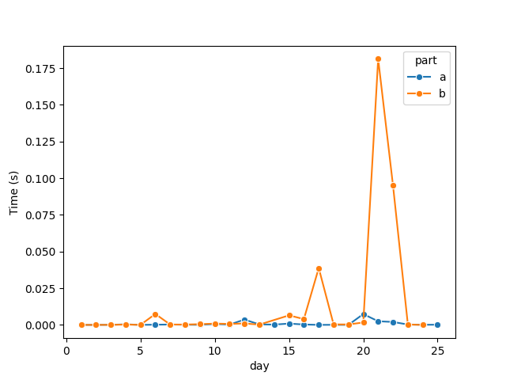
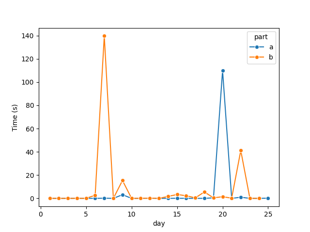

# AOC 2024

## Data

Sample data for testing solutions is stored in the `data` directory with the day and part defined in the file name.

## Solutions

Python solutions are in the `solutions` directory with a python file per day. Each script contains a `solve_a` and
`solve_b` functions which can be imported by `main.main()` for testing and submission.

## Running

```shell
python solutions/day_1.py --part="a" --expected_sample=11
```

Use `--test` to run the sample but not the main puzzle.

## Profiling

#### Example Data



#### Puzzle Data


